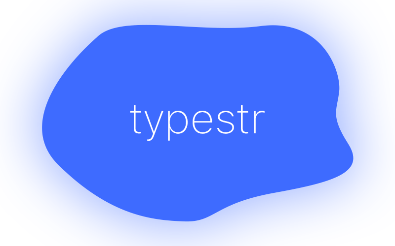

<h1 align="center"><code>typestr</code></h1>
<h2 align="center">TypeScript string library</h1>
<h4 align="center"><code>npm i --save typestr</code></h4>

### Why?

Fantastic question. Is it useful? Probably not in production grade apps but I personally learnt a lot building this and I hope that this can be somewhat of a learning resource at the same time.

### Who?

Myself, my close friend [Rob](https://github.com/robjmorrissey) and some fantastic people from the [TypeScript Discord server](https://discord.gg/typescript).

### How?

ooh great question. painfully!

### Takeaways:

This was an uber fun project to build and there's probably always more methods I/the community could add. If you want some explanation about how some of the types work, shoot me a message

### So, what are the types?

Since this lib is very much WIP and APIs are changing, the best thing for now is to look inside the src folder and see the types for yourself until they are somewhat stable.

### I found a bug!

Nice, there are probably a lot of them. Please [open a GitHub issue](https://github.com/alii/typestr/issues/new) and I'll do my best to resolve it.

### Sponsors

I write open source in my free time and I absolutely love it. If you like what I do please consider [sponsoring me on GitHub!](https://github.com/sponsors/alii)

### Can I contribute?

Please!! Just fork the repo, implement your type and open a PR. I'd absolutely love to have you as a contributor.
